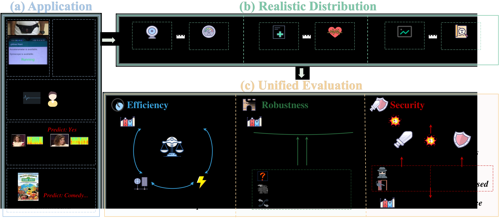

# MARS-VFL: A Unified Benchmark for Vertical Federated Learning with Realistic Evaluation
**The official codes of MARS-VFL,** by [MARS](https://marswhu.github.io/index.html) Group at the [Wuhan University](https://www.whu.edu.cn/), led by [Prof. Mang Ye](https://marswhu.github.io/index.html).



> [MARS-VFL: A Unified Benchmark for Vertical Federated Learning with Realistic Evaluation]()
> 
> Wei Shen, Weiqi Liu, Mingde Chen, Wenke Huang, Mang Ye
> 
> Wuhan University
>
> **Abstract** Vertical Federated Learning (VFL) has emerged as a critical privacy-preserving learning paradigm, enabling collaborative model training by leveraging distributed features across clients. However, due to privacy concerns, there are few publicly available real-world datasets for evaluating VFL methods, which poses significant challenges to related research. To bridge this gap, we propose MARS-VFL, a unified benchmark for realistic VFL evaluation. It integrates data from practical applications involving collaboration across different features, maintaining compatibility with the VFL setting. Based on this, we standardize the evaluation of VFL methods from the mainstream aspects of efficiency, robustness, and security. We conduct comprehensive experiments to assess different VFL approaches, providing references for unified evaluation. Furthermore, we are the first to unify the evaluation of robustness challenges in VFL and introduce a new method for addressing robustness challenges, establishing standard baselines for future research.

## Last Update

**2025/5/13** We have released the codes.

## Guidelines
### 1. Setup
All experiments were conducted on a server with 8 NVIDIA GeForce RTX 4090 GPUs. Clone the repository and install the dependencies from requirements.txt using the Anaconda environment:

```bash
conda create -n marsvfl python=3.9
conda activate marsvfl
git clone 'https://github.com/shentt67/MARS-VFL.git'
cd MARS-VFL
pip install requirements.txt
```
### 2. Datasets
We use 12 different public datasets across five real-world applications:
#### Human Activity Recognition
- UCI-HAR: [UCI-HAR](https://archive.ics.uci.edu/dataset/240/human+activity+recognition+using+smartphones).
- KU-HAR: [KU-HAR](https://www.kaggle.com/datasets/niloy333/kuhar).
#### Robotics
- MUJOCO: Download the data from links: [gentle_push_10.hdf5](https://drive.google.com/file/d/1qmBCfsAGu8eew-CQFmV1svodl9VJa6fX/view), [gentle_push_300.hdf5](https://drive.google.com/file/d/18dr1z0N__yFiP_DAKxy-Hs9Vy_AsaW6Q/view), [gentle_push_1000.hdf5](https://drive.google.com/file/d/1JTgmq1KPRK9HYi8BgvljKg5MPqT_N4cR/view).
- VISION&TOUCH: [VISION&TOUCH](https://github.com/stanford-iprl-lab/multimodal_representation).
#### Healthcare
- MIMIC-III: [MIMIC-III](https://mimic.mit.edu/).
- PTB-XL: [PTB-XL](https://physionet.org/content/ptb-xl/1.0.3/).
#### Emotion Analysis
- UR-FUNNY: [UR-FUNNY](https://drive.google.com/drive/folders/1Agzm157lciMONHOHemHRSySmjn1ahHX1?usp=sharing).
- MUSTARD: [MUSTARD](https://drive.google.com/drive/folders/1JFcX-NF97zu9ZOZGALGU9kp8dwkP7aJ7?usp=sharing).
- CMU-MOSI: [CMU-MOSI](https://drive.google.com/drive/folders/1uEK737LXB9jAlf9kyqRs6B9N6cDncodq?usp=sharing).
- CMU-MOSEI: [CMU-MOSEI](https://drive.google.com/drive/folders/1A_hTmifi824gypelGobgl2M-5Rw9VWHv?usp=sharing).
#### Multimedia
- NUS-WIDE: [NUS-WIDE](https://paperswithcode.com/dataset/nus-wide).
- MM-IMDB: [MM-IMDB](https://archive.org/download/mmimdb/multimodal_imdb.hdf5).

### 3. Evaluation

#### Base usage
For instance, to run the basic pipeline of VFL on the UCI-HAR dataset:
```bash
python main.py --dataset UCIHAR --device 0 --epoch 150 --batch_size 256 --lr 0.01 --client_num 2 --aggregation concat --method_name base --optimizer sgd --seeds 100
```

#### Efficiency
We include three different metrics to evaluate the efficiency of various methods. To run the basic pipeline and perform efficiency evaluation:
```bash
python main.py --dataset UCIHAR --device 0 --epoch 150 --batch_size 256 --lr 0.01 --client_num 2 --aggregation concat --eval_mode efficiency --method_name base --optimizer sgd --seeds 100, 200, 300, 400, 500
```
Change the **--method_name** argument to evaluate different methods (*fedbcd*, *cvfl* and *efvfl*).
#### Robustness
To execute the base pipline and evaluate the robustness:
```bash
python main.py --dataset UCIHAR --device 0 --epoch 150 --batch_size 256 --lr 0.01 --client_num 2 --aggregation concat --eval_mode robustness --perturb_type missing --perturb_rate_train 0 --perturb_rate_test 0 --method_name base --optimizer sgd --seeds 100
```
Change the **--perturb_type** argument for different perturbations (missing, corrupted, misaligned), and Change the **--method_name** argument for different methods (*leefvfl*, *laservfl*, *rvflaug*, *rvflalign*).
#### Security
For instance, to evaluate the *pmc* method on UCI-HAR dataset:
```bash
python main.py --dataset UCIHAR --device 0 --epoch 150 --batch_size 64 --lr 0.01 --client_num 2 --aggregation concat --eval_mode security --method_name pmc --optimizer sgd --seeds 100
```
Change the **--method_name** argument for evaluating different methods (*pmc*, *amc*, *grna*, *mia*, *tecb*, *lfba*).

### 4. Integrate New Methods

The implementations of all evaluated methods are provided in `.\method`, and can be easily extended to include new methods.

## Contact
[weishen@whu.edu.cn](mailto:weishen@whu.edu.cn)

